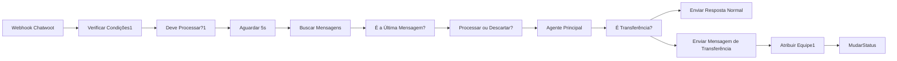

# Análise do workflow: Chatwoot AI Agent - StratosTech Site

**Workflow ID:** `u4JnvFH6j1irhdWo`  
**Trigger:** Webhook POST em `https://webhook.stratostech.com.br/webhook/stratosbot`

---

## Visão geral do fluxo (ramo ativo)



1. **Webhook** recebe o evento do Chatwoot.
2. **Verificar Condições1** monta `shouldProcess` (evento `message_created`, incoming, sem assignee, etc.).
3. **Deve Processar?1** filtra só quando `shouldProcess === true`.
4. **Aguardar 5s** reduz duplicidade quando o Chatwoot envia vários eventos.
5. **Buscar Mensagens da Conversa** chama a API do Chatwoot para listar mensagens.
6. **É a Última Mensagem?** (Code) verifica se a mensagem do webhook ainda é a última; monta `combinedMessage` e `isLastMessage`.
7. **Processar ou Descartar?** só segue se `isLastMessage === true`.
8. **Agente Principal** (LLM + Redis Memory) gera a resposta.
9. **É Transferência?** verifica se a saída contém `[TRANSFERIR_HUMANO]`.
10. **Enviar Resposta Normal** ou **Enviar Mensagem de Transferência** envia a mensagem no Chatwoot.
11. Em caso de transferência: **Atribuir Equipe1** (team_id 3) e **MudarStatus** (pending).

---

## Pontos positivos

- Uso de **Wait + “É a Última Mensagem?”** evita processar a mesma mensagem duas vezes quando o webhook dispara em duplicidade.
- **Redis Memory** por `conversationId` mantém contexto da conversa.
- Separação clara entre resposta normal e transferência para humano.
- Atribuição de equipe e mudança de status na transferência estão alinhadas com o fluxo.

---

## Melhorias recomendadas

### 1. **Transferência para humano nunca dispara (crítico)**

O prompt do **Agente Principal** (Stratos) não instrui o modelo a usar a tag `[TRANSFERIR_HUMANO]`. O nó **É Transferência?** procura exatamente essa string na saída, então a transferência nunca ocorre.

**Ação:** No system message do Agente Principal, incluir uma seção explícita, por exemplo:

```text
# TRANSFERÊNCIA PARA ATENDENTE HUMANO
Transfira APENAS quando:
- O cliente pedir explicitamente: "atendente", "humano", "pessoa", "falar com alguém".
- Pedir orçamento formal ou proposta comercial.
- Situação que exija decisão comercial ou contrato.

Quando for transferir, termine sua resposta com exatamente: [TRANSFERIR_HUMANO]
Exemplo: "Vou acionar um de nossos especialistas para te ajudar. Um momento! [TRANSFERIR_HUMANO]"
```

Ajuste o texto ao tom da Stratos, mas mantenha a instrução de **terminar com** `[TRANSFERIR_HUMANO]`.

---

### 2. **Verificar Condições1 – checagem do sender**

Hoje o código usa:

`body.conversation?.messages?.[0]?.sender?.type === 'contact'`

Em muitos payloads do webhook Chatwoot (evento `message_created`), a mensagem atual e o sender vêm em outros campos (por exemplo `body.sender` ou no objeto da mensagem dentro do evento), e não em `conversation.messages[0]`. Com isso, `isFromContact` pode ser sempre `false` e o fluxo pode nunca processar.

**Ação:** Conferir no Chatwoot a estrutura real do webhook (ou inspecionar um execution no n8n) e usar o caminho correto, por exemplo:

- `body.sender?.type === 'contact'`, ou
- O objeto da mensagem que o Chatwoot envia no evento (ex.: `body.message?.sender?.type`).

Garantir que apenas mensagens do **contato** (e não do agente/bot) sejam processadas.

---

### 3. **Estrutura da resposta de “Buscar Mensagens da Conversa”**

A API do Chatwoot retorna as mensagens no campo **`payload`** (array). O código em **É a Última Mensagem?** usa `$input.item.json.payload`, o que está alinhado com a API.

Só vale garantir que o nó HTTP Request esteja passando o body da resposta para o próximo nó (sem envelopar de novo). Se em algum momento a resposta for mapeada para outro formato (ex.: só `data`), a leitura deve usar o campo que realmente vier no `$input.item.json` (ex.: `payload` ou `data`).

---

### 4. **Tempo de espera (5s)**

5 segundos deixam a resposta um pouco mais lenta. Se os eventos duplicados forem raros, dá para testar **3 segundos** para melhorar a percepção de velocidade, mantendo a lógica de “última mensagem”.

---

### 5. **Tratamento de erros**

Os nós HTTP (Buscar Mensagens, Enviar Resposta, Atribuir Equipe, MudarStatus) não têm tratamento de erro. Se a API do Chatwoot falhar (timeout, 5xx), o workflow quebra sem retry.

**Ação:** Nos nós HTTP críticos, ativar **“Continue On Fail”** ou usar um nó **Error Trigger** + fluxo de fallback (ex.: mensagem padrão “Estamos com instabilidade, tente em instantes” ou log para monitoramento).

---

### 6. **Credenciais da API**

O token do Chatwoot está fixo nos nós (header `api_access_token`). O ideal é usar **Credential** do n8n (ex.: HTTP Header Auth) e referenciar em todos os nós que chamam a API do Chatwoot. Assim fica mais seguro e fácil de rotacionar o token.

---

### 7. **Ramo “Webhook Chatwoot1” (fluxo Wladvan) desativado**

Há um segundo fluxo (Webhook Chatwoot1 → Verificar Condições → … → Agente Principal1 com persona Wladvan, conta 2). Todos os nós estão **disabled** e o contexto é de outro cliente (Wladvan).

**Ação:** Se não for usar esse ramo neste workflow, considerar removê-lo para não confundir. Se for reutilizar no futuro, deixar um comentário no workflow ou na descrição explicando que é um template/cópia para outra conta.

---

### 8. **Consistência da conta (account_id)**

- Fluxo ativo (Stratos): **account 1** em todas as chamadas.
- Fluxo desativado: **account 2**.

Confirmar no Chatwoot que a **conta 1** é a da Stratos Tech e que o inbox do site está nessa conta. Assim evita enviar mensagens ou atribuições para a conta errada.

---

## Resumo de prioridade

| Prioridade | Item | Ação |
|-----------|------|------|
| Alta | Transferência nunca dispara | Incluir no prompt do Agente Principal a regra e o uso de `[TRANSFERIR_HUMANO]`. |
| Alta | Sender no webhook | Ajustar Verificar Condições1 para usar o campo correto do payload (ex.: `body.sender`) conforme documentação/execução real. |
| Média | Erros de API | Ativar “Continue On Fail” ou Error Trigger + fallback nos HTTP. |
| Média | Credenciais | Migrar token para Credential do n8n. |
| Baixa | Wait 5s → 3s | Testar redução se duplicidade for baixa. |
| Baixa | Limpeza | Remover ou documentar o fluxo “Webhook Chatwoot1” (Wladvan). |

---

Se quiser, posso sugerir o trecho exato de prompt (system message) para colar no n8n e um exemplo de código para o nó **Verificar Condições1** com `body.sender` (assumindo a estrutura típica do Chatwoot).
